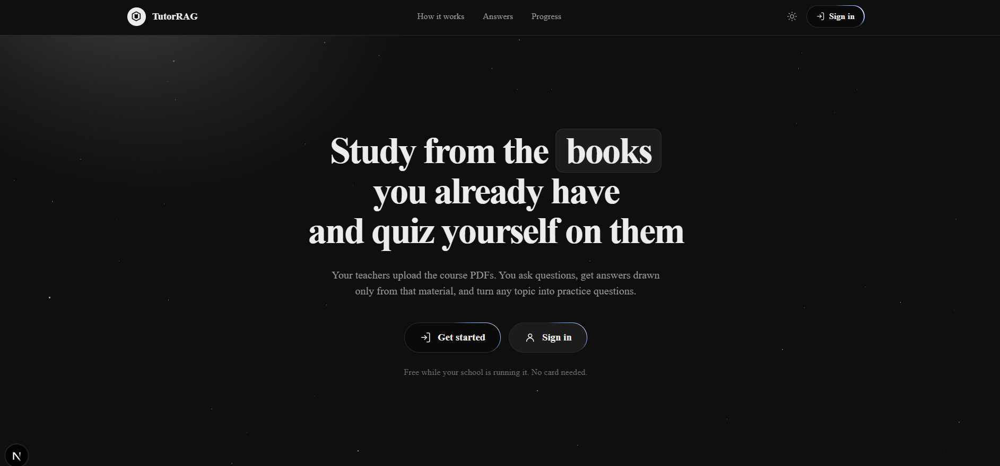

# TutorRAG



Retrieval-augmented tutor app. Teachers upload PDFs; students chat with the material and take auto-generated quizzes.

- `server/` — FastAPI, MongoDB, Pinecone, Groq
- `client/` — Next.js 15 (TypeScript, Tailwind)

## Setup

**API keys** `.env` (MongoDB, Google, Pinecone, Groq).

**Server**
```bash
cd server
python -m venv .venv && source .venv/bin/activate
pip install -r requirements.txt
uvicorn main:app --reload --port 8000
```
Requires a Pinecone index matching `models/gemini-embedding-001`.

**Client**
```bash
cd client
npm install
npm run dev
```

## Architecture

Browser → Next.js API routes → FastAPI. Auth is HTTP Basic; Next.js stores the credentials in an httpOnly cookie and never exposes them to the browser or client JS. Fine for coursework — swap to JWTs/server sessions before running this for real.

## Routes

| Route | Role |
| --- | --- |
| `/chat`, `/quiz`, `/history` | student |
| `/documents` | teacher (upload PDFs) |
| `/login`, `/signup` | guest — Google sign-in optional, off until configured |

## Known limits

- **`POST /upload_docs` has no server-side auth check** — client blocks non-teachers, but the API doesn't. Fix before deploying.
- Quiz grading needs the model to emit `Correct Answer: X`; otherwise `/quiz` returns 502.
- Uploads capped at 25MB; retrieval is a fixed `top_k=5`.
- Google sign-in is implemented but untested end-to-end.
